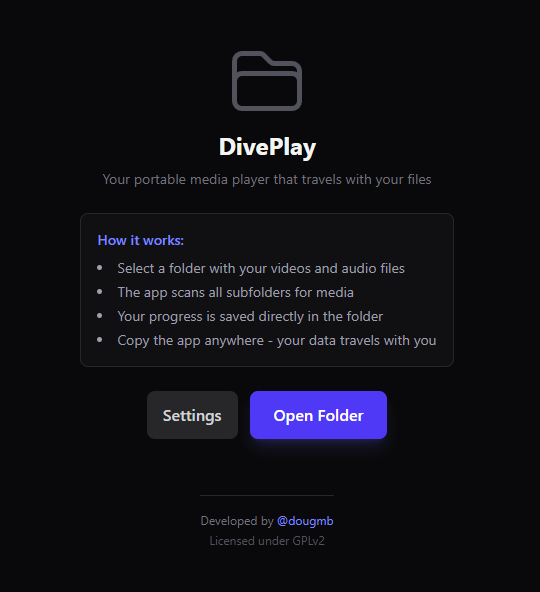

# DivePlay

A browser-based media player that lives in your folders and works with your local files.
One single HTML file. Put it anywhere.



> ⚠️ **Note:** Some media files may not play because they require codecs not supported natively by the browser (e.g. AC3, DTS audio, or certain video formats). See [Limitations](#limitations) below.

## Download

Get the latest release from [GitHub Releases](https://github.com/dougmb/diveplay/releases)

## Features

- 📁 **Auto-playlist** — scans the entire selected folder and builds a playlist with all media files automatically
- 🔁 **Playback modes** — Sequential, Shuffle, or Loop All
- ⏱️ **Resume where you left off** — progress, volume and current file are saved and restored on next open
- 🎬 Subtitle support (SRT, VTT, SUB)
- ⌨️ Keyboard shortcuts (Space, arrows, F, M)
- 📴 Works fully offline — no internet required

## How It Works

### 📂 Folder Scan & Auto-Playlist

When you open a folder, DivePlay **scans all files inside it** and automatically builds a playlist with every supported media file found. Files are listed in the sidebar and play sequentially by default.

### 🔀 Playback Order

You can switch the playback mode at any time using the controls in the player:

| Mode | Description |
|------|-------------|
| **Sequential** | Plays files in alphabetical order, one after another |
| **Shuffle** | Randomizes the playlist order |
| **Loop All** | Repeats the entire playlist indefinitely |

### ⏱️ Resume Where You Left Off

DivePlay automatically saves your progress to a `.player-state.json` file inside the media folder. Next time you open the same folder, it offers to **resume from exactly where you stopped** — including the current file, timestamp, volume, and playback settings.

> 💡 This feature requires Chrome or Edge (browsers that support the File System Access API).

## Supported Browsers

- **Chrome / Edge** (recommended): Full features including folder selection and state persistence
- **Firefox / Safari**: Limited - select individual files, no state saving

## Usage

1. Open `index.html` in a Chromium browser
2. Select a folder with your media
3. Click any file to play

## Keyboard Shortcuts

| Key | Action |
|-----|--------|
| Space | Play/Pause |
| ← → | Seek -10s / +10s |
| ↑ ↓ | Volume |
| F | Fullscreen |
| M | Mute |

## Build

```bash
npm install
npm run build
```

Output in `dist/`.

## Limitations

### Codec Support

DivePlay relies entirely on the browser's built-in media decoders. **Some files may fail to play** if they use codecs that are not natively supported:

| Format | Status | Notes |
|--------|--------|-------|
| H.264 / AAC | ✅ Works | Most common video/audio |
| H.265 / HEVC | ⚠️ Partial | Supported only in some Chromium builds |
| AC3 / Dolby Digital | ❌ May not work | Not supported natively in most browsers |
| DTS audio | ❌ May not work | Not supported natively in most browsers |
| VP9 / Opus | ✅ Works | Open formats, well supported |
| AV1 | ✅ Works | Modern open format |

If a file does not play, try re-encoding the audio/video track to a format supported by your browser (e.g. AAC audio, H.264 video).

## License

[GPLv2](LICENSE)

[](https://ko-fi.com/Q5Q61UQM6J)